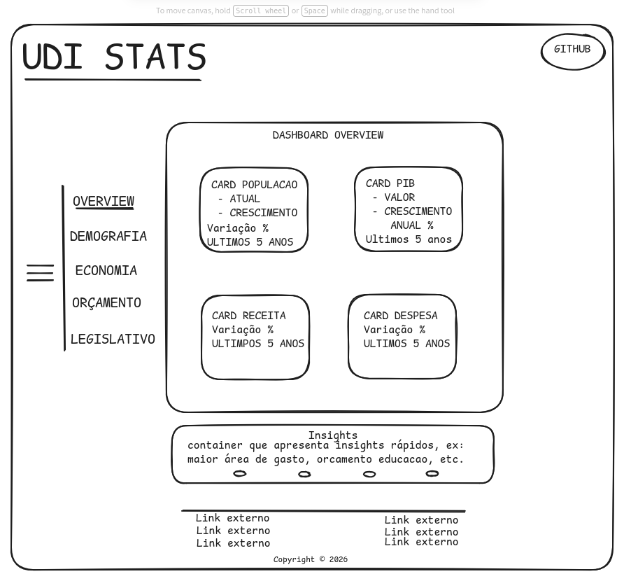

# UDI Stats

**UDI Stats** é uma plataforma de transparência ativa que transforma dados públicos de Uberlândia em visualizações compreensíveis. O projeto utiliza tecnologias modernas para normalizar dados complexos e apresentá-los de forma intuitiva aos cidadãos.

---

## Objetivo Principal
Tornar os dados públicos municipais de Uberlândia visualmente acessíveis, permitindo que qualquer cidadão acompanhe indicadores de demografia, economia, orçamento e legislativo através de um dashboard modular e dinâmico.

## Wireframe Inicial
O projeto segue uma estrutura de layout fixo com troca dinâmica de conteúdo por módulos.

![Wireframe do Dashboard]

> *Conceito inicial: Navegação lateral e cards de indicadores estratégicos no Overview.*

## Estrutura de Pastas Planejada
A aplicação foi estruturada para ser escalável e modular:

```text
udi-stats/
src/
├── app/
│   ├── layout.tsx          # Layout raiz (header + sidebar + footer)
│   ├── page.tsx            # Redireciona para /overview
│   ├── overview/
│   │   └── page.tsx        # Página Overview
│   ├── demografia/
│   │   └── page.tsx        # Página Demografia
│   ├── economia/
│   │   └── page.tsx        # Página Economia
│   ├── orcamento/
│   │   └── page.tsx        # Página Orçamento
│   └── legislativo/
│       └── page.tsx        # Página Legislativo
│
├── components/
│   ├── layout/
│   │   ├── Header.tsx      # Header com logo, GitHub e toggle dark/light
│   │   ├── Sidebar.tsx     # Navegação lateral
│   │   └── Footer.tsx      # Links externos e copyright
│   ├── overview/
│   │   ├── StatCard.tsx    # Card reutilizável (População, PIB, etc.)
│   │   └── InsightsBar.tsx # Seção de insights
│   └── ui/
│       └── ThemeToggle.tsx # Botão de alternar dark/light
│
├── data/
│   ├── demografia.ts       # Dados de população (JSON local)
│   ├── economia.ts         # Dados de PIB
│   └── orcamento.ts        # Dados de receita e despesa
│
└── lib/
    └── utils.ts            # Funções utilitárias (formatação de números, etc.)

---

## Tecnologias Utilizadas
- Framework: Next.js
- Linguagem: TypeScript
- Gráficos: Recharts
- Estilização: Tailwind CSS

## Funcionalidades em Desenvolvimento
- Módulo Overview: Painel resumo com variação de 5 anos (PIB, População, Receita).
- Módulo Demografia: Detalhamento populacional.
- Módulo Economia: Indicadores de crescimento e mercado local.
- Módulo Orçamento: Visualização de gastos e receitas públicas.
- Módulo Legislativo: Dados da câmara municipal.
- Seção Insights: Gerador de análises rápidas sobre os dados apresentados.